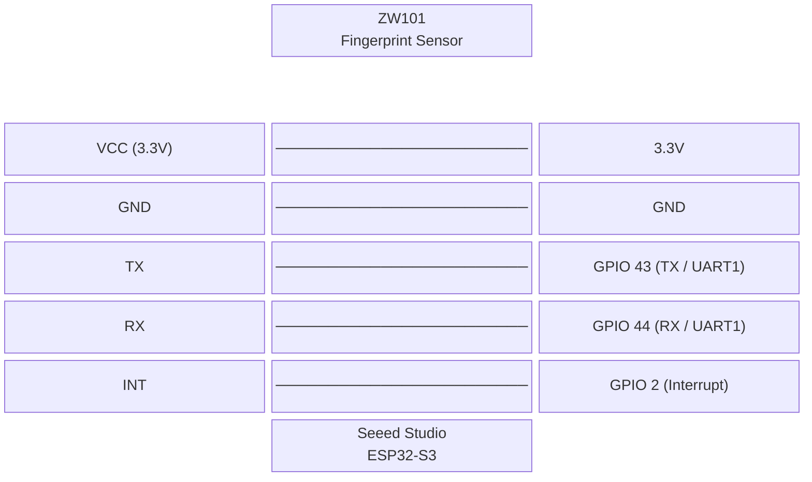

## interested in preassembled versions? pre order now:

# tinytouch
authenticate, sudo, and log in with your fingerprint wire(less)ly without having
to spend $149.

build guide: https://www.youtube.com/watch?v=YsP1hRg28Gw

https://github.com/user-attachments/assets/efede271-6d84-441d-919c-f5532f687c4e

PIV authentication of sudo:

https://github.com/user-attachments/assets/c197dd9c-81e5-4150-9793-d2e445651dfd

PIV authentication of lockscreen (you know its PIV because it says PIN and not password in the entry field) (the typing is just the PIV PIN, which we bypass (since we gate by the fingerprint), read below to learn more about it)

https://github.com/user-attachments/assets/88014cb2-34d2-4d63-8998-54f0561364eb

if you would like to support this project, please consider [donating](https://github.com/sponsors/ZimengXiong) or contributing!

## table of contents

- [red pill or blue pill?](#red-pill-or-blue-pill)
- [install](#install)
  - [install the mac app](#install-the-mac-app)
  - [set up tinytouch](#set-up-tinytouch)
- [hardware](#hardware)
- [wiring](#wiring)

## red pill or blue pill?

there are two ways to use tinytouch on your computer: `HID` and `PIV/PAM` mode. read about how they work in the sections below.

each has its advantages, and we want to scare you a tiny bit so you actually do
your diligence and understand the security implications of such a device before
you decide whether you are willing to take on the risks:

| features | HID | PIV/PAM* |
| -- | -- | -- |
| keyboardless login | ✅ | ✅ |
| sudo prompts | ✅ | ✅ |
| apple TCC (privacy & security) | ✅ | ✅|
| general settings | ✅ | ❌ |
| keychain/apple passwords | ✅ | ❌ |
| everywhere your password is accepted (remote SSH sessions, etc) | ✅ | depends, but probably not |

| security | HID | PIV/PAM* |
| -- | -- | -- |
| fingerprint sensor <-> esp | 🔴 (unauth'ed UART) | 🔴 (unauth'ed UART) |
| esp <-> computer negotiation | 🟢 (shared-key mac/encryption) | 🔴 (plain usb ccid/apdu) |
| authentication | 🔴 (password typed over hid) | 🟢 (piv challenge/response) |

| attack | HID | PIV/PAM* |
| -- | -- | -- |
| sensor uart spoofing^ | yes | yes |
| wrong focused field | yes | no |
| malicious password field | yes | no |
| usb traffic sniffing | low impact (channel is encrypted/mac'ed) | can observe apdus, not piv private key |
| usb keylogger | can reveal password | cannot reveal key |
| usb command injection | reject bad macs/replays | device may receive apdus, but auth still needs fingerprint-gated key use |
| flash dumping (secure boot/flash encryption off) | shared-key exposable | piv key exposable |
| flash dumping (secure boot/flash encryption on) | shared-key non-exportable | piv key non-exportable |
| flash dumping (with secure element) | shared key non-exportable | piv key non-exportable |

*PIV/PAM always uses HID to deliver the mandatory PIV PIN, which we do not use.
authorization is still gated by your fingerprint. the PIV PIN is not your
password, and is not considered sensitive in our scenario.

^this is the major security issue with this device. since all authentication
happens inside the fingerprint sensor, and the sensor communicates with the esp
over unauthenticated uart, it can be easily spoofed. basic countermeasures
involve filling the insides of the device with black epoxy. a more proper fix
would be upgrading to a more secure fingerprint sensor.

### so... which pill, if any?
this depends on:

1. your security tolerance
2. your environment
3. current/future criminal background
4. family/roommate relations
5. technical skill set of family members/roommates

risks are low to begin with since every attack here requires *physical access* to
both the device and your mac.

so ask yourself: will your device ever leave your desk? can your roommates
perform a flash dump in half an hour? how about your family members? do they have
anything against you that would create a motive? are you wanted by any government
agency? are you protecting sensitive or classified information? are you using a
company device? would you be personally implicated if you leaked company secrets?

if the answer is yes to any of the above questions, i think the magic keyboard presents an excellent value at $149 and is worth the added security.

if the answer is no, chances are you will be fine with a slightly insecure method
of authentication. personally, i am happy with the red pill and love the
convenience of having it work everywhere.

### hid mode

in hid mode, the esp acts like a usb keyboard.

the native mac app keeps your real password and pairing key in your login
keychain. this way, an attacker cannot extract your password from the esp alone.
after a fingerprint match, the esp sends a signed request to the app, the app
checks it, encrypts the password for that one request, and sends it back. the esp
decrypts it in ram, types it, then wipes it.

this is why it works almost everywhere. it is also why it is scary: the final
step is still your real password being typed into whatever has focus.

to make it less bad, the esp never stores the password. requests use a nonce and
mac so old requests cannot just be replayed, and the app only sends back an
encrypted one-time response. the password only exists on the esp briefly in ram.

### piv mode

in piv mode, the esp acts like a usb smart card.

macos sends normal piv commands over ccid. when macos needs authentication, it
asks the card to use the piv private key. the esp only allows that key operation
right after a fingerprint match.

macos also expects a piv pin, so the firmware has a tiny hid side path that types
the dummy pin `000000`. that pin is not your mac password. it is just there to
get through the macos piv prompt while the real authorization is the fingerprint
gate around the piv key.

this avoids typing your real password, but only works where macos accepts smart
cards, like login and `sudo` with pam.

## install

the native app requires macos 13 or later. it handles firmware installation,
fingerprint enrollment, HID credentials, PIV identities, and macos pairing.

### install the mac app

1. download `TinyTouch-macOS.zip` from the newest
   [`app-v*` release](https://github.com/misa198/tinyTouch/releases/latest/download/TinyTouch-macOS.zip).
2. unzip it and move `TinyTouch.app` to `/Applications`.
3. control-click the app and choose **Open** the first time.
4. leave **Launch TinyTouch at login** enabled. HID mode needs the app running
   in the menu bar.

### set up tinytouch

connect tinytouch and open the app from the menu bar. a factory-default device
starts the setup wizard automatically:

- choose **HID** to store your mac password in the login keychain and type it
  after a fingerprint match.
- choose **PIV** to create the smart-card identity. reconnect the device when
  prompted, then touch the sensor at the macos pin prompt; tinytouch enters its
  dummy pin automatically.

the wizard enrolls the first fingerprint and performs the remaining device and
macos setup. use **Fingerprints**, **Computers**, **Firmware**, and **Settings**
in the app for later changes.

for a blank ESP32-S3, put the board in rom/download mode, choose **Flash a Blank
Board** on the welcome screen, and follow the prompts. no command-line tools are
required.

## hardware

| part | used here | notes |
| -- | -- | -- |
| microcontroller | seeed studio esp32-s3 | needs native usb and hardware uart. secure boot + flash encryption strongly recommended |
| fingerprint sensor | zw101-style uart sensor | uses the common `0xef01` packet protocol |
| computer | macos 13 or later | hid mode needs the TinyTouch menu-bar app. piv/pam mode uses macos smart card support |
| case | printed top/bottom stl | `hardware/case/case_top.stl` and `hardware/case/case_bottom.stl` |
| wiring/solder/etc | misc | whatever your build needs |

other esp32-s3 boards should work if the usb and uart pins are available. other
fingerprint sensors may work if they speak the same uart protocol. other
microcontroller families can work, but are not currently supported.

## wiring

the fingerprint sensor connects over uart (uart1) to the esp32-s3. the interrupt
pin signals when a finger is detected.

| sensor pin | esp32-s3 pin | notes |
| -- | -- | -- |
| VCC | 3.3V | do not use 5V |
| GND | GND | common ground |
| TX | GPIO 43 (TX) | sensor tx → esp gpio 43 |
| RX | GPIO 44 (RX) | sensor rx → esp gpio 44 |
| INT | GPIO 2 | finger-present interrupt, active high |

[cad](https://cad.onshape.com/documents/d0e6bb7977e6171d4e4a5086/w/1ded27ad6c634fd1fdaf26d0/e/aca67210e400490a08d0b29a?renderMode=0&uiState=6a4c1df32e292f12144a65fe). if you make changes, please make them open source as well.

## bonus images

